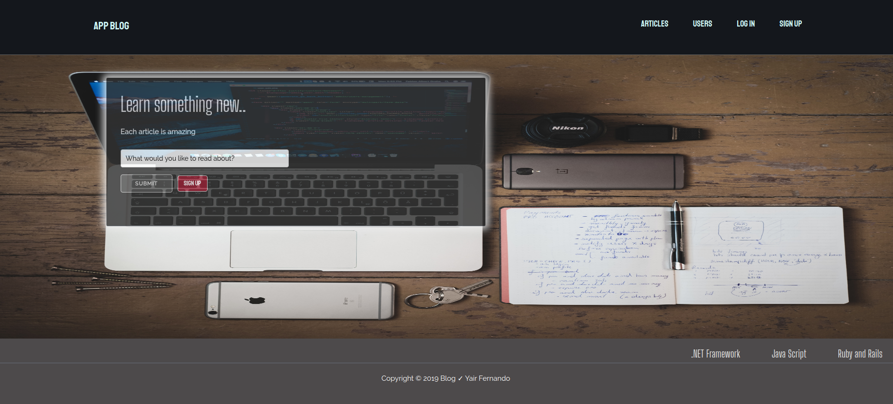

<!-- PROJECT LOGO -->
 

  <!--  -->

  <h3 align="center">Blog Application :smile:</h3>

  

    Project developed with Ruby and rails that is based on a blog application.
     
    <a href="https://github.com/YairFernando67/BlogApplication"><strong>Explore the docs »</strong></a>
     
     
    <a href="https://github.com/YairFernando67/BlogApplication/issues">Report Bug</a>
    ·
  

<!-- TABLE OF CONTENTS -->
## Table of Contents

* [About the Project](#about-the-project)
  * [Built With](#built-with)
* [Contact](#contact)
* [Acknowledgements](#acknowledgements)

<!-- ABOUT THE PROJECT -->
## About The Project

In this project we'll find many features about user authentication system, many to many relationships,
some handy methods that can help you when it comes to easly present data to the user. 

### Built With
The project was developed using these tools and technologies.
* [CSS3](https://developer.mozilla.org/en-US/docs/Web/CSS)
* [HTML5](https://www.w3schools.com/html/)
* [Reset CSS File](https://necolas.github.io/normalize.css/)
* [Ruby](https://www.ruby-lang.org/es/)
* [Ruby and Rails](https://rubyonrails.org/)
* [JQuery Rails](https://github.com/rails/jquery-rails)

<!-- CONTACT -->
## Contact

Yair Fernando Facio Fraga - [YairFernando67](https://github.com/YairFernando67) - yair.facio11@gmail.com  

Project Link: [https://github.com/YairFernando67/BlogApplication](https://github.com/YairFernando67/BlogApplication)

<!-- ACKNOWLEDGEMENTS -->
## Acknowledgements

- [Guard Livereload](https://github.com/guard/guard-livereload) - Provides a livereload on the browser when your local files change.
- [Guard](https://github.com/guard/guard) - Work with files when they change
- [Gravatar Image Tag](https://github.com/mdeering/gravatar_image_tag) - It is helpful to use user's gravatar based on their emails
- [Better Errors](https://github.com/charliesome/better_errors) - Give you a better display of the errors. 
- [Bcrypt](https://github.com/codahale/bcrypt-ruby) - The bcrypt Ruby gem provides a simple wrapper for safely handling passwords.
- [will_paginate](https://github.com/mislav/will_paginate) - will_paginate provides a simple API for performing paginated queries with Active Record
- [bootstrap-will_paginate](https://github.com/yrgoldteeth/bootstrap-will_paginate) - Hooks into will_paginate to format the html to match Twitter Bootstrap styling
- [hirb](http://tagaholic.me/hirb/doc/) - It desplays a better view of the database
- [Impressionist](https://github.com/charlotte-ruby/impressionist) - To count views
